# Complete System Flow Analysis

## System Architecture Overview

```
┌─────────────────┐    ┌───────────────────┐     ┌─────────────────┐
│  OfferingFactory│────│WrappedTokenFactory│──── │   Offering      │
│                 │    │                   │     │                 │
└─────────────────┘    └───────────────────┘     └─────────────────┘
         │                                               │
         │                                               │
         ▼                                               ▼
┌─────────────────┐                              ┌─────────────────┐
│InvestmentManager│◄─────────────────────────────│   WrapedToken   │
│                 │                              │                 │
└─────────────────┘                              └─────────────────┘
         │                                               │
         │                                               │
         ▼                                               ▼
┌─────────────────┐                              ┌─────────────────┐
│     Escrow      │                              │   Payout System │
│                 │                              │                 │
└─────────────────┘                              └─────────────────┘
```

## Flow 1: Offering Creation & Deployment

### Standard Offering Creation (Without APY)
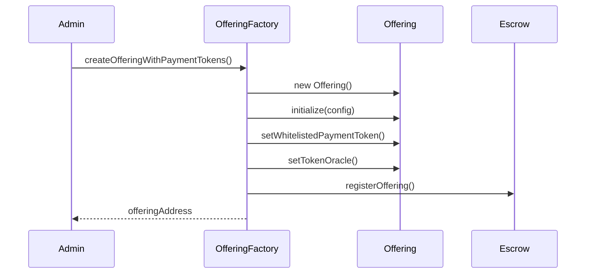
```mermaid
sequenceDiagram
    participant Admin
    participant OfferingFactory
    participant Offering
    participant Escrow
    
    Admin->>OfferingFactory: createOfferingWithPaymentTokens()
    OfferingFactory->>Offering: new Offering()
    OfferingFactory->>Offering: initialize(config)
    OfferingFactory->>Offering: setWhitelistedPaymentToken()
    OfferingFactory->>Offering: setTokenOracle()
    OfferingFactory->>Escrow: registerOffering()
    OfferingFactory-->>Admin: offeringAddress
```

### APY-Enabled Offering Creation
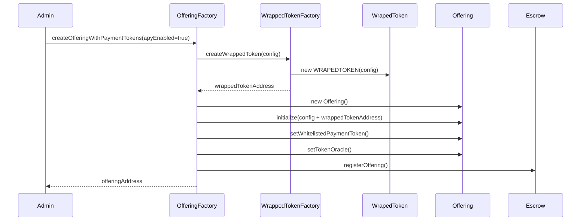
```mermaid
sequenceDiagram
    participant Admin
    participant OfferingFactory
    participant WrappedTokenFactory
    participant WrapedToken
    participant Offering
    participant Escrow
    
    Admin->>OfferingFactory: createOfferingWithPaymentTokens(apyEnabled=true)
    OfferingFactory->>WrappedTokenFactory: createWrappedToken(config)
    WrappedTokenFactory->>WrapedToken: new WRAPEDTOKEN(config)
    WrappedTokenFactory-->>OfferingFactory: wrappedTokenAddress
    OfferingFactory->>Offering: new Offering()
    OfferingFactory->>Offering: initialize(config + wrappedTokenAddress)
    OfferingFactory->>Offering: setWhitelistedPaymentToken()
    OfferingFactory->>Offering: setTokenOracle()
    OfferingFactory->>Escrow: registerOffering()
    OfferingFactory-->>Admin: offeringAddress
```

## Flow 2: Investment Process

### Standard Investment Flow (Without APY)
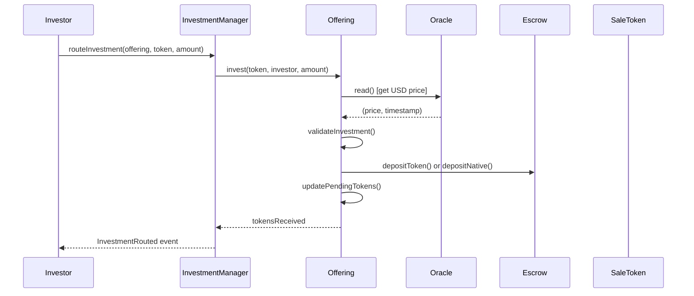
```mermaid
sequenceDiagram
    participant Investor
    participant InvestmentManager
    participant Offering
    participant Oracle
    participant Escrow
    participant SaleToken
    
    Investor->>InvestmentManager: routeInvestment(offering, token, amount)
    InvestmentManager->>Offering: invest(token, investor, amount)
    Offering->>Oracle: read() [get USD price]
    Oracle-->>Offering: (price, timestamp)
    Offering->>Offering: validateInvestment()
    Offering->>Escrow: depositToken() or depositNative()
    Offering->>Offering: updatePendingTokens()
    Offering-->>InvestmentManager: tokensReceived
    InvestmentManager-->>Investor: InvestmentRouted event
```

### APY Investment Flow
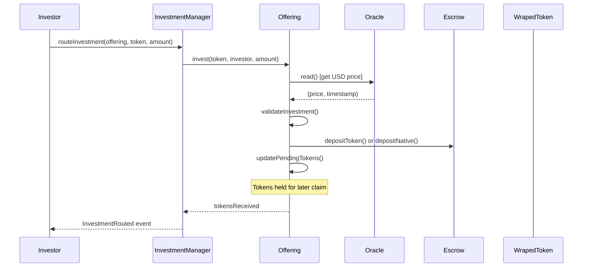
```mermaid
sequenceDiagram
    participant Investor
    participant InvestmentManager
    participant Offering
    participant Oracle
    participant Escrow
    participant WrapedToken
    
    Investor->>InvestmentManager: routeInvestment(offering, token, amount)
    InvestmentManager->>Offering: invest(token, investor, amount)
    Offering->>Oracle: read() [get USD price]
    Oracle-->>Offering: (price, timestamp)
    Offering->>Offering: validateInvestment()
    Offering->>Escrow: depositToken() or depositNative()
    Offering->>Offering: updatePendingTokens()
    Note over Offering: Tokens held for later claim
    Offering-->>InvestmentManager: tokensReceived
    InvestmentManager-->>Investor: InvestmentRouted event
```

### KYB-Validated Investment Flow
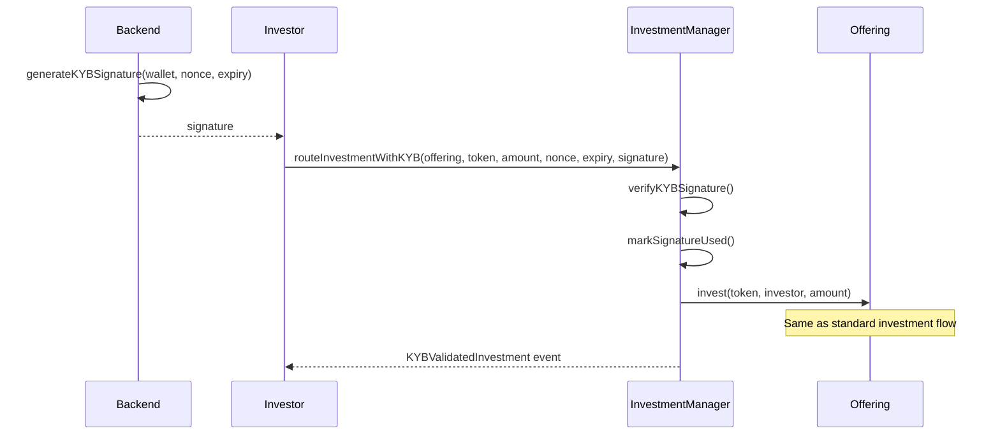
```mermaid
sequenceDiagram
    participant Backend
    participant Investor
    participant InvestmentManager
    participant Offering
    
    Backend->>Backend: generateKYBSignature(wallet, nonce, expiry)
    Backend-->>Investor: signature
    Investor->>InvestmentManager: routeInvestmentWithKYB(offering, token, amount, nonce, expiry, signature)
    InvestmentManager->>InvestmentManager: verifyKYBSignature()
    InvestmentManager->>InvestmentManager: markSignatureUsed()
    InvestmentManager->>Offering: invest(token, investor, amount)
    Note over Offering: Same as standard investment flow
    InvestmentManager-->>Investor: KYBValidatedInvestment event
```

## Flow 3: Token Claiming Process

### Standard Token Claim (Without APY)
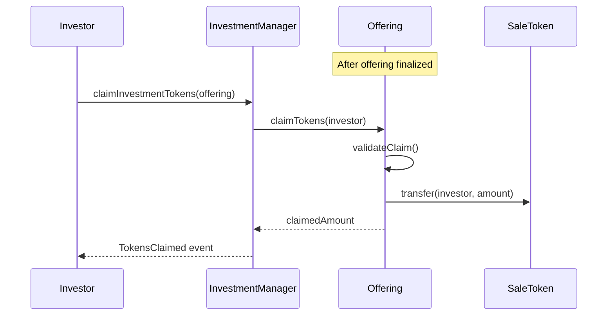
```mermaid
sequenceDiagram
    participant Investor
    participant InvestmentManager
    participant Offering
    participant SaleToken
    
    Note over Offering: After offering finalized
    Investor->>InvestmentManager: claimInvestmentTokens(offering)
    InvestmentManager->>Offering: claimTokens(investor)
    Offering->>Offering: validateClaim()
    Offering->>SaleToken: transfer(investor, amount)
    Offering-->>InvestmentManager: claimedAmount
    InvestmentManager-->>Investor: TokensClaimed event
```

### APY Token Claim (Wrapped Token Creation)
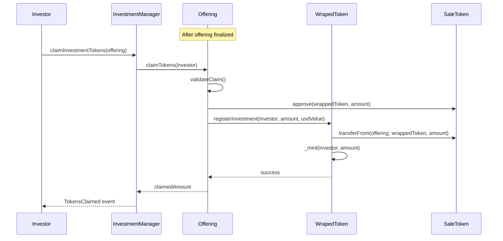
```mermaid
sequenceDiagram
    participant Investor
    participant InvestmentManager
    participant Offering
    participant WrapedToken
    participant SaleToken
    
    Note over Offering: After offering finalized
    Investor->>InvestmentManager: claimInvestmentTokens(offering)
    InvestmentManager->>Offering: claimTokens(investor)
    Offering->>Offering: validateClaim()
    Offering->>SaleToken: approve(wrappedToken, amount)
    Offering->>WrapedToken: registerInvestment(investor, amount, usdValue)
    WrapedToken->>SaleToken: transferFrom(offering, wrappedToken, amount)
    WrapedToken->>WrapedToken: _mint(investor, amount)
    WrapedToken-->>Offering: success
    Offering-->>InvestmentManager: claimedAmount
    InvestmentManager-->>Investor: TokensClaimed event
```

## Flow 4: Payout Distribution System

### Payout Setup and Distribution
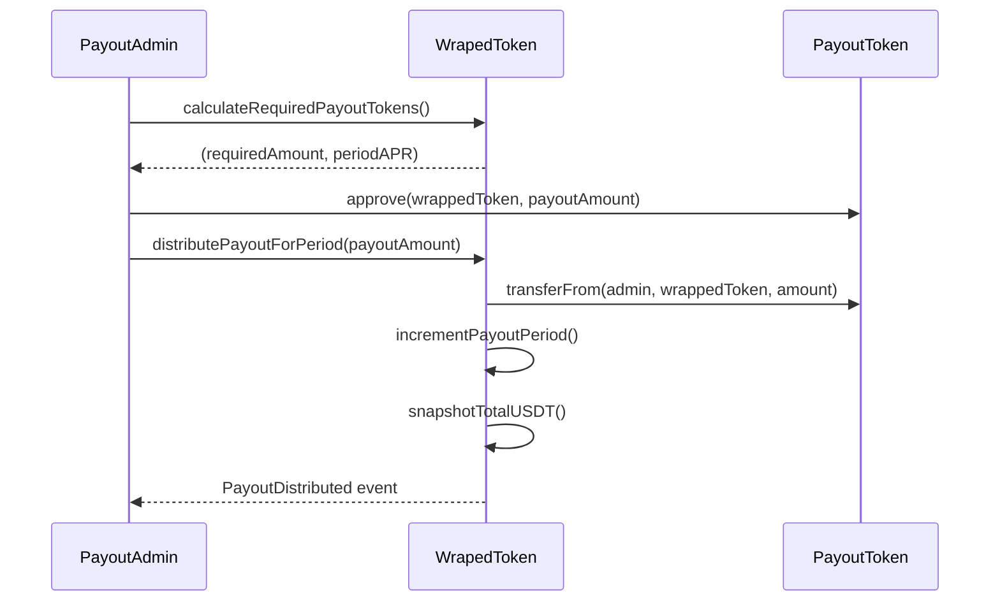
```mermaid
sequenceDiagram
    participant PayoutAdmin
    participant WrapedToken
    participant PayoutToken
    
    PayoutAdmin->>WrapedToken: calculateRequiredPayoutTokens()
    WrapedToken-->>PayoutAdmin: (requiredAmount, periodAPR)
    PayoutAdmin->>PayoutToken: approve(wrappedToken, payoutAmount)
    PayoutAdmin->>WrapedToken: distributePayoutForPeriod(payoutAmount)
    WrapedToken->>PayoutToken: transferFrom(admin, wrappedToken, amount)
    WrapedToken->>WrapedToken: incrementPayoutPeriod()
    WrapedToken->>WrapedToken: snapshotTotalUSDT()
    WrapedToken-->>PayoutAdmin: PayoutDistributed event
```

### Payout Claiming Process
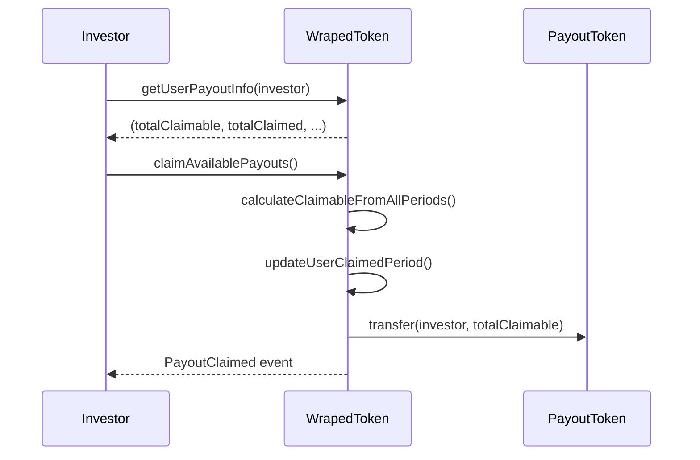
```mermaid
sequenceDiagram
    participant Investor
    participant WrapedToken
    participant PayoutToken
    
    Investor->>WrapedToken: getUserPayoutInfo(investor)
    WrapedToken-->>Investor: (totalClaimable, totalClaimed, ...)
    Investor->>WrapedToken: claimAvailablePayouts()
    WrapedToken->>WrapedToken: calculateClaimableFromAllPeriods()
    WrapedToken->>WrapedToken: updateUserClaimedPeriod()
    WrapedToken->>PayoutToken: transfer(investor, totalClaimable)
    WrapedToken-->>Investor: PayoutClaimed event
```

### Multiple Payout Rounds Flow
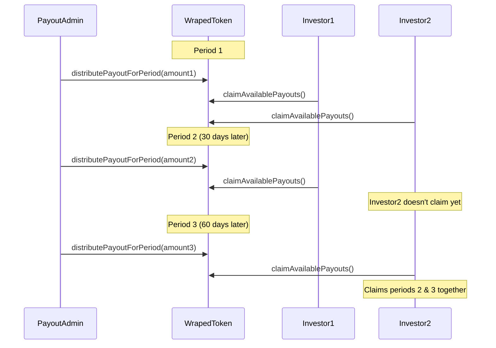
```mermaid
sequenceDiagram
    participant PayoutAdmin
    participant WrapedToken
    participant Investor1
    participant Investor2
    
    Note over WrapedToken: Period 1
    PayoutAdmin->>WrapedToken: distributePayoutForPeriod(amount1)
    Investor1->>WrapedToken: claimAvailablePayouts()
    Investor2->>WrapedToken: claimAvailablePayouts()
    
    Note over WrapedToken: Period 2 (30 days later)
    PayoutAdmin->>WrapedToken: distributePayoutForPeriod(amount2)
    Investor1->>WrapedToken: claimAvailablePayouts()
    Note over Investor2: Investor2 doesn't claim yet
    
    Note over WrapedToken: Period 3 (60 days later)
    PayoutAdmin->>WrapedToken: distributePayoutForPeriod(amount3)
    Investor2->>WrapedToken: claimAvailablePayouts()
    Note over Investor2: Claims periods 2 & 3 together
```

## Flow 5: Offering Finalization

### Successful Offering Finalization
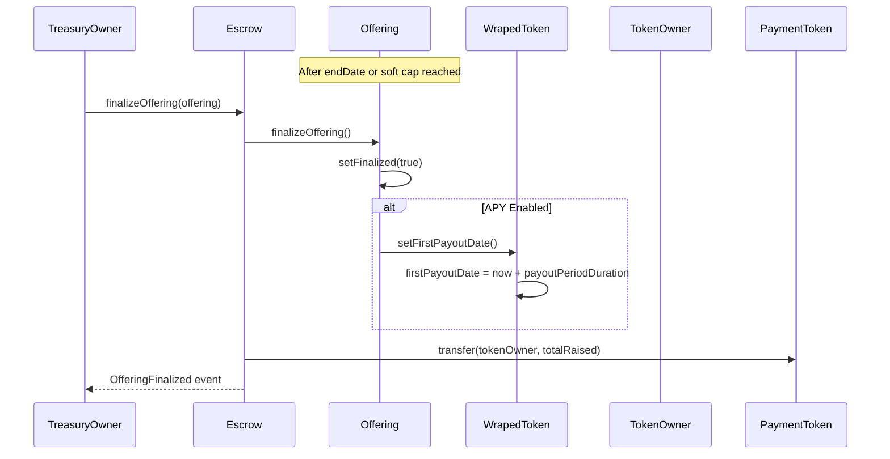
```mermaid
sequenceDiagram
    participant TreasuryOwner
    participant Escrow
    participant Offering
    participant WrapedToken
    participant TokenOwner
    participant PaymentToken
    
    Note over Offering: After endDate or soft cap reached
    TreasuryOwner->>Escrow: finalizeOffering(offering)
    Escrow->>Offering: finalizeOffering()
    Offering->>Offering: setFinalized(true)
    alt APY Enabled
        Offering->>WrapedToken: setFirstPayoutDate()
        WrapedToken->>WrapedToken: firstPayoutDate = now + payoutPeriodDuration
    end
    Escrow->>PaymentToken: transfer(tokenOwner, totalRaised)
    Escrow-->>TreasuryOwner: OfferingFinalized event
```

### Early Finalization (Soft Cap Reached)
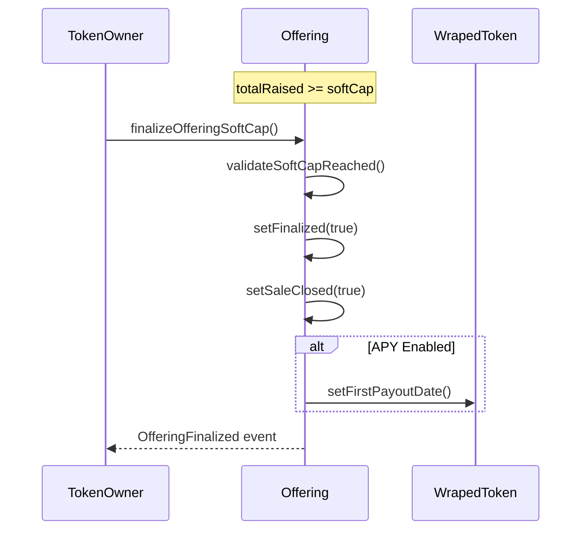
```mermaid
sequenceDiagram
    participant TokenOwner
    participant Offering
    participant WrapedToken
    
    Note over Offering: totalRaised >= softCap
    TokenOwner->>Offering: finalizeOfferingSoftCap()
    Offering->>Offering: validateSoftCapReached()
    Offering->>Offering: setFinalized(true)
    Offering->>Offering: setSaleClosed(true)
    alt APY Enabled
        Offering->>WrapedToken: setFirstPayoutDate()
    end
    Offering-->>TokenOwner: OfferingFinalized event
```

## Flow 6: Cancellation and Refund Process

### Offering Cancellation Flow
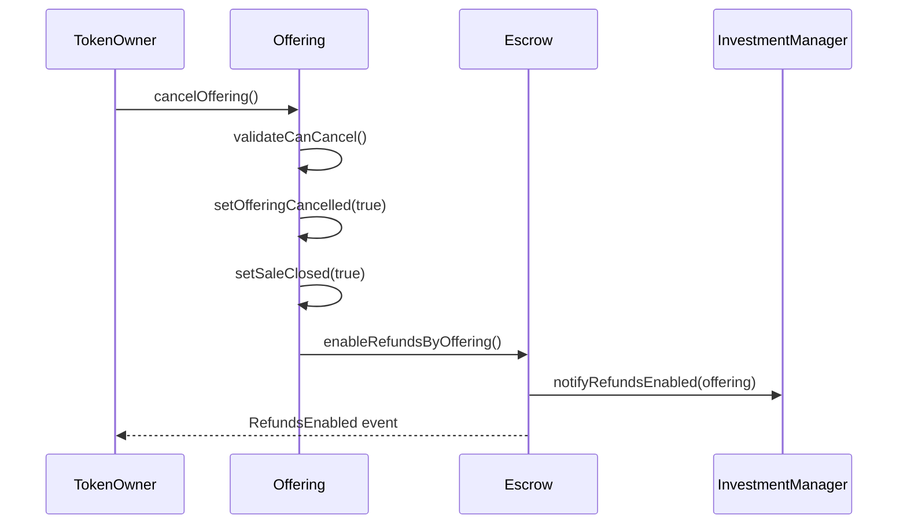
```mermaid
sequenceDiagram
    participant TokenOwner
    participant Offering
    participant Escrow
    participant InvestmentManager
    
    TokenOwner->>Offering: cancelOffering()
    Offering->>Offering: validateCanCancel()
    Offering->>Offering: setOfferingCancelled(true)
    Offering->>Offering: setSaleClosed(true)
    Offering->>Escrow: enableRefundsByOffering()
    Escrow->>InvestmentManager: notifyRefundsEnabled(offering)
    Escrow-->>TokenOwner: RefundsEnabled event
```

### Refund Claiming Process
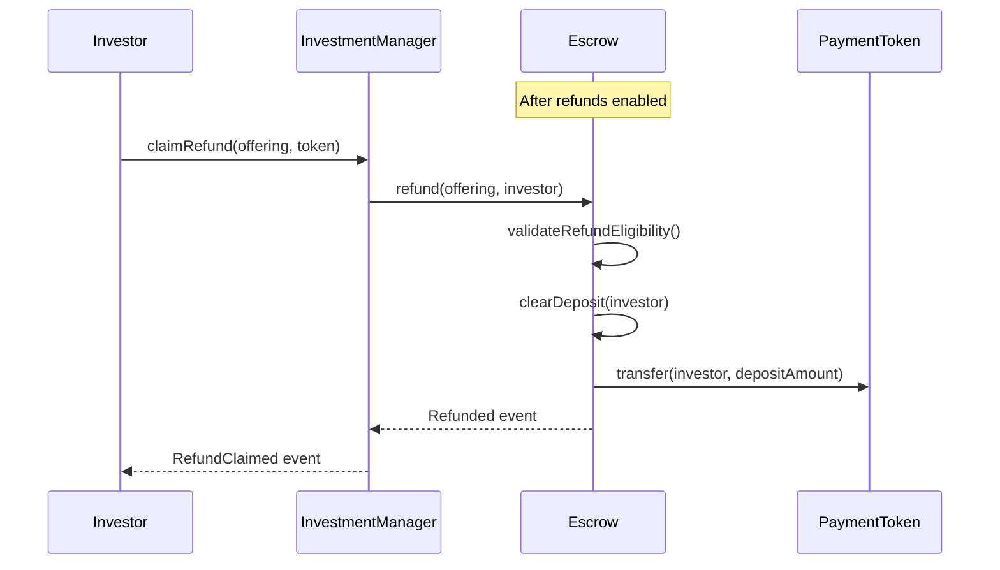
```mermaid
sequenceDiagram
    participant Investor
    participant InvestmentManager
    participant Escrow
    participant PaymentToken
    
    Note over Escrow: After refunds enabled
    Investor->>InvestmentManager: claimRefund(offering, token)
    InvestmentManager->>Escrow: refund(offering, investor)
    Escrow->>Escrow: validateRefundEligibility()
    Escrow->>Escrow: clearDeposit(investor)
    Escrow->>PaymentToken: transfer(investor, depositAmount)
    Escrow-->>InvestmentManager: Refunded event
    InvestmentManager-->>Investor: RefundClaimed event
```

### Admin Emergency Refund
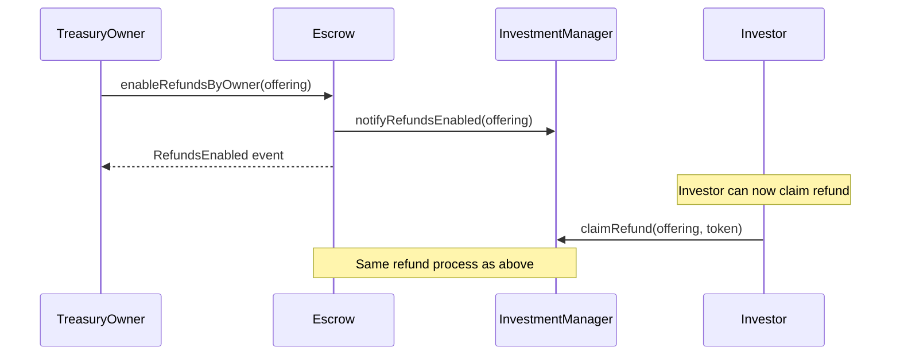
```mermaid
sequenceDiagram
    participant TreasuryOwner
    participant Escrow
    participant InvestmentManager
    participant Investor
    
    TreasuryOwner->>Escrow: enableRefundsByOwner(offering)
    Escrow->>InvestmentManager: notifyRefundsEnabled(offering)
    Escrow-->>TreasuryOwner: RefundsEnabled event
    
    Note over Investor: Investor can now claim refund
    Investor->>InvestmentManager: claimRefund(offering, token)
    Note over InvestmentManager,Escrow: Same refund process as above
```

## Flow 7: Emergency Unlock System

### Emergency Unlock Setup
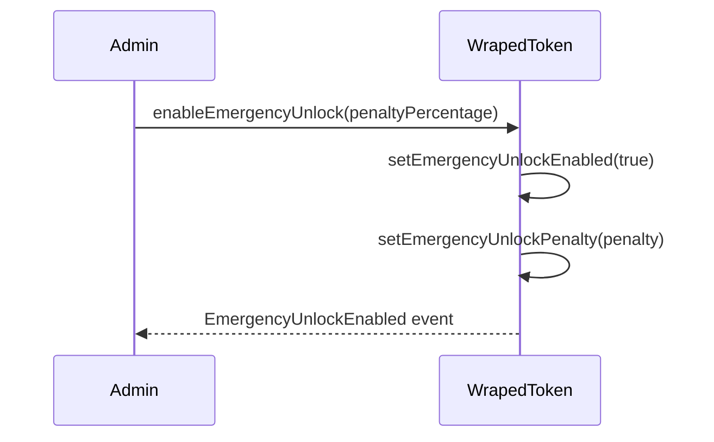
```mermaid
sequenceDiagram
    participant Admin
    participant WrapedToken
    
    Admin->>WrapedToken: enableEmergencyUnlock(penaltyPercentage)
    WrapedToken->>WrapedToken: setEmergencyUnlockEnabled(true)
    WrapedToken->>WrapedToken: setEmergencyUnlockPenalty(penalty)
    WrapedToken-->>Admin: EmergencyUnlockEnabled event
```

### Emergency Unlock Usage
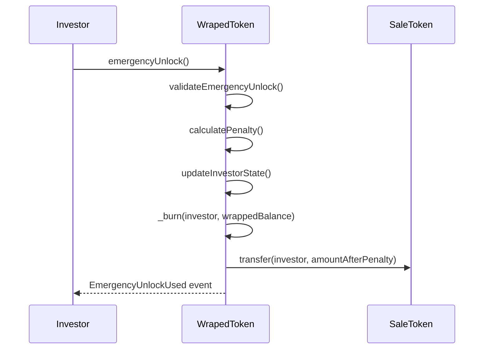
```mermaid
sequenceDiagram
    participant Investor
    participant WrapedToken
    participant SaleToken
    
    Investor->>WrapedToken: emergencyUnlock()
    WrapedToken->>WrapedToken: validateEmergencyUnlock()
    WrapedToken->>WrapedToken: calculatePenalty()
    WrapedToken->>WrapedToken: updateInvestorState()
    WrapedToken->>WrapedToken: _burn(investor, wrappedBalance)
    WrapedToken->>SaleToken: transfer(investor, amountAfterPenalty)
    WrapedToken-->>Investor: EmergencyUnlockUsed event
```

### Emergency Unlock with Payout History
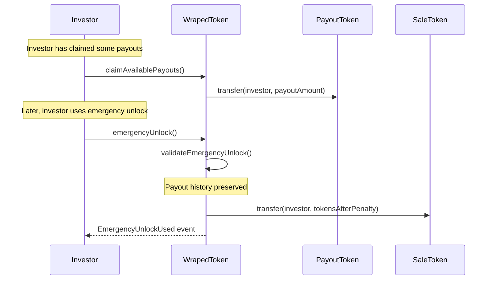
```mermaid
sequenceDiagram
    participant Investor
    participant WrapedToken
    participant PayoutToken
    participant SaleToken
    
    Note over Investor: Investor has claimed some payouts
    Investor->>WrapedToken: claimAvailablePayouts()
    WrapedToken->>PayoutToken: transfer(investor, payoutAmount)
    
    Note over Investor: Later, investor uses emergency unlock
    Investor->>WrapedToken: emergencyUnlock()
    WrapedToken->>WrapedToken: validateEmergencyUnlock()
    Note over WrapedToken: Payout history preserved
    WrapedToken->>SaleToken: transfer(investor, tokensAfterPenalty)
    WrapedToken-->>Investor: EmergencyUnlockUsed event
```

## Flow 8: Token Maturity and Final Claims

### Final Token Redemption
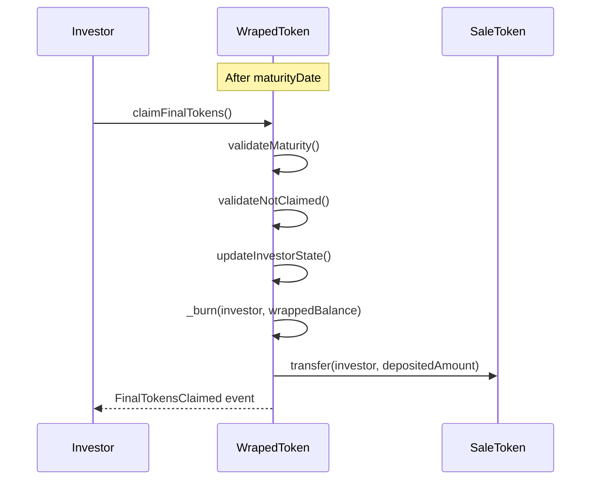
```mermaid
sequenceDiagram
    participant Investor
    participant WrapedToken
    participant SaleToken
    
    Note over WrapedToken: After maturityDate
    Investor->>WrapedToken: claimFinalTokens()
    WrapedToken->>WrapedToken: validateMaturity()
    WrapedToken->>WrapedToken: validateNotClaimed()
    WrapedToken->>WrapedToken: updateInvestorState()
    WrapedToken->>WrapedToken: _burn(investor, wrappedBalance)
    WrapedToken->>SaleToken: transfer(investor, depositedAmount)
    WrapedToken-->>Investor: FinalTokensClaimed event
```

### Complete APY Lifecycle
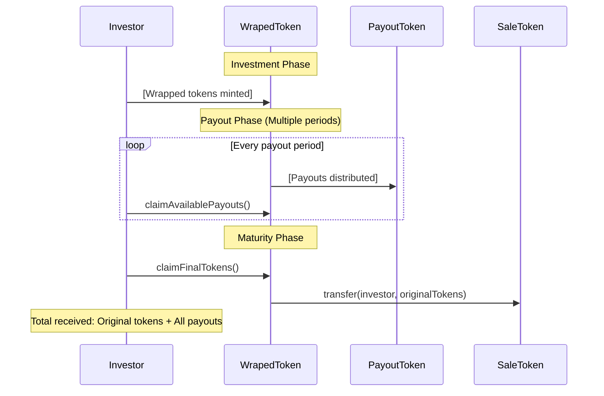
```mermaid
sequenceDiagram
    participant Investor
    participant WrapedToken
    participant PayoutToken
    participant SaleToken
    
    Note over WrapedToken: Investment Phase
    Investor->>WrapedToken: [Wrapped tokens minted]
    
    Note over WrapedToken: Payout Phase (Multiple periods)
    loop Every payout period
        WrapedToken->>PayoutToken: [Payouts distributed]
        Investor->>WrapedToken: claimAvailablePayouts()
    end
    
    Note over WrapedToken: Maturity Phase
    Investor->>WrapedToken: claimFinalTokens()
    WrapedToken->>SaleToken: transfer(investor, originalTokens)
    
    Note over Investor: Total received: Original tokens + All payouts
```

## Flow 9: Multi-Investor Scenarios

### Proportional Payout Distribution
```mermaid
sequenceDiagram
    participant Investor1
    participant Investor2
    participant Investor3
    participant WrapedToken
    participant PayoutAdmin
    
    Note over WrapedToken: Investor1: $600 (60%), Investor2: $300 (30%), Investor3: $100 (10%)
    PayoutAdmin->>WrapedToken: distributePayoutForPeriod($1000)
    
    Investor1->>WrapedToken: claimAvailablePayouts()
    Note over Investor1: Receives $600 (60% of $1000)
    
    Investor2->>WrapedToken: claimAvailablePayouts()
    Note over Investor2: Receives $300 (30% of $1000)
    
    Investor3->>WrapedToken: claimAvailablePayouts()
    Note over Investor3: Receives $100 (10% of $1000)
```

### Dynamic Rebalancing After Emergency Unlock
```mermaid
sequenceDiagram
    participant Investor1
    participant Investor2
    participant WrapedToken
    participant PayoutAdmin
    
    Note over WrapedToken: Initial: Investor1: 50%, Investor2: 50%
    PayoutAdmin->>WrapedToken: distributePayoutForPeriod($1000)
    Investor1->>WrapedToken: claimAvailablePayouts()
    Investor2->>WrapedToken: claimAvailablePayouts()
    Note over Investor1,Investor2: Each gets $500
    
    Note over Investor1: Investor1 uses emergency unlock
    Investor1->>WrapedToken: emergencyUnlock()
    
    Note over WrapedToken: Now only Investor2 remains (100%)
    PayoutAdmin->>WrapedToken: distributePayoutForPeriod($800)
    Investor2->>WrapedToken: claimAvailablePayouts()
    Note over Investor2: Gets full $800
```

## Flow 10: Cross-Contract Communication

### Investment Manager ↔ Offering Communication
```mermaid
sequenceDiagram
    participant InvestmentManager
    participant Offering
    participant Escrow
    
    InvestmentManager->>Offering: invest()
    Offering->>Escrow: depositToken()
    Offering-->>InvestmentManager: tokensReceived
    
    InvestmentManager->>Offering: claimTokens()
    Offering-->>InvestmentManager: claimedAmount
```

### Offering ↔ WrappedToken Communication
```mermaid
sequenceDiagram
    participant Offering
    participant WrapedToken
    participant SaleToken
    
    Offering->>WrapedToken: registerInvestment()
    WrapedToken->>SaleToken: transferFrom()
    WrapedToken->>WrapedToken: _mint()
    
    Offering->>WrapedToken: setFirstPayoutDate()
    WrapedToken->>WrapedToken: firstPayoutDate = calculated
```

### Escrow ↔ InvestmentManager Communication
```mermaid
sequenceDiagram
    participant Escrow
    participant InvestmentManager
    
    Escrow->>InvestmentManager: notifyRefundsEnabled()
    InvestmentManager->>InvestmentManager: setRefundsEnabled(true)
    
    InvestmentManager->>Escrow: refund()
    Escrow->>Escrow: processRefund()
```

## Flow 11: State Transitions

### Offering State Machine
```mermaid
stateDiagram-v2
    [*] --> Created
    Created --> Active : startDate reached
    Active --> Closed : endDate reached OR cap reached
    Active --> Cancelled : cancelOffering()
    Closed --> Finalized : finalizeOffering()
    Cancelled --> RefundsEnabled : enableRefunds()
    
    state Active {
        [*] --> AcceptingInvestments
        AcceptingInvestments --> SoftCapReached : totalRaised >= softCap
        SoftCapReached --> AcceptingInvestments : still accepting
        AcceptingInvestments --> CapReached : totalRaised >= fundraisingCap
        CapReached --> [*]
    }
```

### WrappedToken State Machine
```mermaid
stateDiagram-v2
    [*] --> Created
    Created --> AcceptingInvestments : offering active
    AcceptingInvestments --> PayoutPhase : offering finalized
    PayoutPhase --> Matured : maturityDate reached
    Matured --> Claimed : claimFinalTokens()
    
    PayoutPhase --> EmergencyUnlocked : emergencyUnlock()
    AcceptingInvestments --> EmergencyUnlocked : emergencyUnlock()
    
    state PayoutPhase {
        [*] --> AwaitingPayout
        AwaitingPayout --> PayoutAvailable : distributePayoutForPeriod()
        PayoutAvailable --> PayoutClaimed : claimAvailablePayouts()
        PayoutClaimed --> AwaitingPayout : next period
    }
```

## Flow 12: Error Handling and Edge Cases

### Investment Validation Flow
```mermaid
flowchart TD
    A[Investment Request] --> B{Sale Active?}
    B -->|No| C[Revert: Sale not started/ended]
    B -->|Yes| D{Token Whitelisted?}
    D -->|No| E[Revert: Token not whitelisted]
    D -->|Yes| F{Amount >= Min?}
    F -->|No| G[Revert: Below min investment]
    F -->|Yes| H{Amount <= Max?}
    H -->|No| I[Revert: Exceeds max investment]
    H -->|Yes| J{Total <= Cap?}
    J -->|No| K[Revert: Exceeds cap]
    J -->|Yes| L[Process Investment]
```

### Payout Claim Validation Flow
```mermaid
flowchart TD
    A[Payout Claim Request] --> B{User Has Deposit?}
    B -->|No| C[Revert: NoDeposit]
    B -->|Yes| D{Emergency Unlocked?}
    D -->|Yes| E[Revert: NoDeposit]
    D -->|No| F{Final Tokens Claimed?}
    F -->|Yes| G[Revert: AlreadyClaimed]
    F -->|No| H{Payouts Available?}
    H -->|No| I[Revert: NoPayout]
    H -->|Yes| J[Process Payout Claim]
```

### Emergency Unlock Validation Flow
```mermaid
flowchart TD
    A[Emergency Unlock Request] --> B{Emergency Enabled?}
    B -->|No| C[Revert: UnlockDisabled]
    B -->|Yes| D{User Has Deposit?}
    D -->|No| E[Revert: NoDeposit]
    D -->|Yes| F{Already Unlocked?}
    F -->|Yes| G[Revert: AlreadyClaimed]
    F -->|No| H{Final Tokens Claimed?}
    H -->|Yes| I[Revert: AlreadyClaimed]
    H -->|No| J[Process Emergency Unlock]
```

## Flow 13: Gas Optimization Patterns

### Batch Operations Flow
```mermaid
sequenceDiagram
    participant User
    participant Contract
    
    Note over User,Contract: Instead of multiple single operations
    User->>Contract: claimPayoutForPeriod(period1)
    User->>Contract: claimPayoutForPeriod(period2)
    User->>Contract: claimPayoutForPeriod(period3)
    
    Note over User,Contract: Use batch operation
    User->>Contract: claimPayoutsInRange(period1, period3)
    Contract->>Contract: Loop through periods efficiently
```

### Storage Optimization Flow
```mermaid
flowchart TD
    A[Storage Read] --> B{Cached?}
    B -->|Yes| C[Use Cached Value]
    B -->|No| D[Read from Storage]
    D --> E[Cache Value]
    E --> F[Use Value]
    C --> G[Continue Execution]
    F --> G
```

## Flow 14: Security Patterns

### Reentrancy Protection Flow
```mermaid
sequenceDiagram
    participant Attacker
    participant Contract
    participant ExternalContract
    
    Attacker->>Contract: maliciousFunction()
    Contract->>Contract: nonReentrant modifier check
    Contract->>Contract: set reentrancy guard
    Contract->>ExternalContract: external call
    ExternalContract->>Contract: reentrant call attempt
    Contract->>Contract: nonReentrant modifier check
    Contract-->>ExternalContract: Revert: ReentrancyGuardReentrantCall
```

### Access Control Flow
```mermaid
flowchart TD
    A[Function Call] --> B{Has Required Role?}
    B -->|No| C[Revert: AccessControlUnauthorizedAccount]
    B -->|Yes| D[Execute Function]
    D --> E{Role-Specific Logic}
    E --> F[Complete Execution]
```

### Oracle Security Flow
```mermaid
sequenceDiagram
    participant Contract
    participant Oracle
    
    Contract->>Oracle: read()
    Oracle-->>Contract: (price, timestamp)
    Contract->>Contract: validate price > 0
    Contract->>Contract: validate timestamp freshness
    alt Price or timestamp invalid
        Contract->>Contract: Revert: Invalid/Stale price
    else Valid
        Contract->>Contract: Use price for calculations
    end
```

## Flow 15: Monitoring and Events

### Event Emission Flow
```mermaid
flowchart TD
    A[State Change] --> B[Emit Relevant Event]
    B --> C{Multiple Contracts Involved?}
    C -->|Yes| D[Emit Events in Each Contract]
    C -->|No| E[Single Event Emission]
    D --> F[Subgraph Indexing]
    E --> F
    F --> G[Frontend Updates]
    F --> H[Analytics Dashboard]
    F --> I[Monitoring Alerts]
```

### Critical Event Categories
```mermaid
mindmap
  root((Events))
    Investment
      InvestmentRouted
      KYBValidatedInvestment
      Invested
    Payout
      PayoutDistributed
      PayoutClaimed
      FinalTokensClaimed
    Emergency
      EmergencyUnlockEnabled
      EmergencyUnlockUsed
      RefundsEnabled
      RefundClaimed
    Lifecycle
      OfferingDeployed
      OfferingFinalized
      OfferingCancelled
      SaleClosed
```

This comprehensive flow documentation covers all major system interactions, state transitions, and edge cases in the offering platform. Each flow is designed to be traceable and auditable for security and operational purposes.